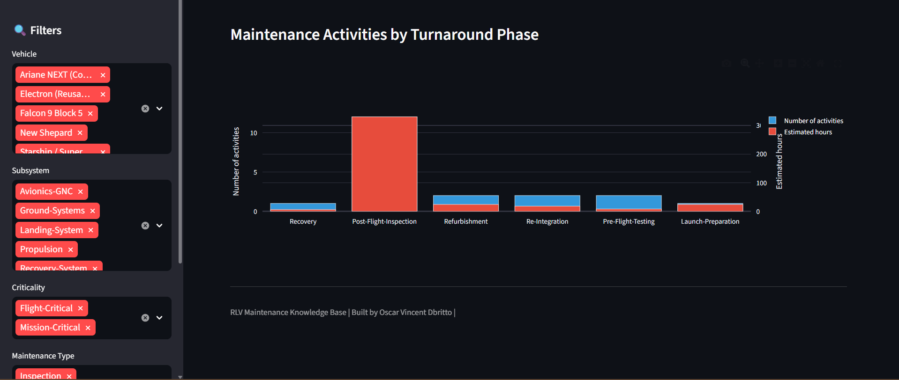

# 🚀 Reusable Launch Vehicle Maintenance Knowledge Base

## Overview
Systematic collection, classification, and framework for 
maintenance practices on Reusable Launch Vehicles (RLVs). 
Covers 5 vehicles (Falcon 9, New Shepard, Starship, 
Electron, Ariane NEXT) across 9 subsystems with 20 
documented maintenance records.

## Live Demo
**[Open Dashboard](https://rlv-maintenance-knowledge-base-vrddr8ajpgobntjjafdluf.streamlit.app/)**

## Features
- Searchable, filterable maintenance records database
- Classification taxonomy (subsystem, type, method, phase, criticality)
- Statistical overview with interactive charts
- Vehicle comparison matrix with radar profiles
- CSV export for further analysis
- Methodology and limitations documentation

## Context
Built in the context of DLR Institute of Maintenance and 
Modification research on maintenance considerations for 
Reusable Launch Vehicles. The growing demand for satellite 
launches has driven RLV development, but associated 
maintenance technology remains in its infancy.

## Relevance
- Directly mirrors DLR research tasks: identify, classify, 
  and create a framework for RLV maintenance data
- Demonstrates structured, methodological approach to 
  scientific data collection and documentation
- Supports life cycle analysis and product lifecycle 
  management research

## Author
**Oscar Vincent Dbritto** | M.Sc. Digitalization & Automation | [Portfolio](https://oscardbritto.framer.website/) | [Linkedin](https://www.linkedin.com/in/oscar-dbritto/)
